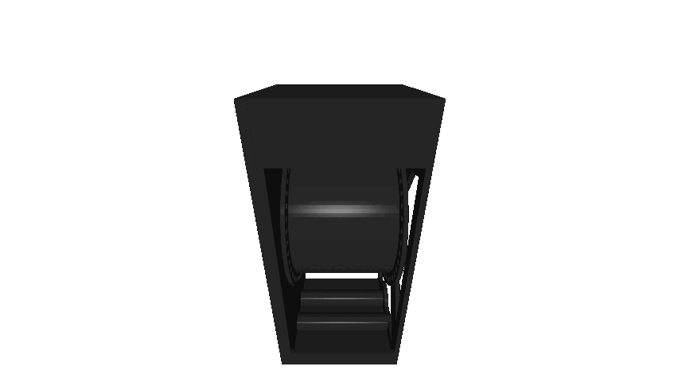

# 3D Printable split flap display

Welcome to **split-flap-controller**, the firmware + hardware design for driving a modular, scalable split-flap display system.

Development of this project began in 2024 with the goal of creating a robust, DIY split-flap display that anyone can build and customize themselves. Inspired by the iconic Frankfurt Airport display, this project aims to recreate the nostalgic mechanical aesthetic and characteristic flipping sound that made those displays so memorable.

__Ongoing Project! This repository is not final.__

## Project goals
- **Modularity** – Each flap module is independent and addressable, allowing for scalable display sizes.  
- **DIY-Friendly Design** – Open schematics, PCBs, and firmware make it accessible for makers and hobbyists.  
- **Robust Firmware** – Written in C, with features like error handling, EEPROM-stored calibration, and motor homing logic.  
- **Authentic Aesthetic** – Recreates the distinctive motion and sound of traditional airport-style displays.  
- **Modern Communication** – Supports RS-485 half-duplex at 57600 baud with WebSocket integration for control from a host system.  
- **Open for Extension** – Designed to support other MCUs, motor drivers, or mechanical formats.

## Features

### Hardware
- SMD-based controller board (Atmega8 MCU)  
- Modular RS-485 communication chain 
- Integrated motor driver and position sensor handling
- Modules connect to a single backplane
- Hall-effect sensor homing
- Robust error handling
  - detects homing faults, stuck drums, overcurrent and bus errors
  - activates a failSafe condition on critical fault
  - can be reset via RS485 in most conditions
  - checks validity of each packet via checksum
  

### Firmware
- Lightweight communication protocol with checksum and addressing  
- Fault detection (homing failure, overcurrent, invalid position)  
- Persistent settings stored in EEPROM  
- CRC check of each message

### Software
- WebSocket-based control server  
- Modular architecture for future GUI or API integrations  
- Easily portable to other platforms and MCUs
- Nginx Webserver allows you to controll the display with your smartphone
- very fast and written in plan c. I'm using libjson and libws for JSON handling and the WebSocket server

## CAD
This display is designed in **Fusion360**. All schematics and boards are designed in **KiCAD 9**.

Most parts can be 3d printed. The modular backpanel needs to be fabricated from sheetmetal. You can use suppliers like JLCPCB for manufacturing or design a different 3d printable solution.

If you want to generate custom flaps, you can find my flap generator here: [split-flap-generator](https://github.com/dennis9819/split-flap-generator)

## License

This project is open source and available under the [AGPL-3.0 License](LICENSE).

## Documentation
- [SFBus Protocol](software/pc_client/doc/sfbus-proto.md)
- [Websockets Protocol](software/pc_client/doc/api-doc.md)
- [BOM](cad/BOM_FlapUnit.md)
- Build guide wil follow soon!

## Power Consumption
Each Module pulls arround 110mA. This is roughly 1.4W of power. 
This can be reduced by turning off the motors in idle. 

---
## Credits
This is a 3D printable, expandable split flap display based on the original design of [David Königsmann](https://github.com/davidkingsman/split-flap).
This version uses his drum and flap design but completly redesigns the rest of the system.

The firmware as well as the Server is completly rewritten from scratch.

Feel free to checkout his more affordable and diy friendly design.

